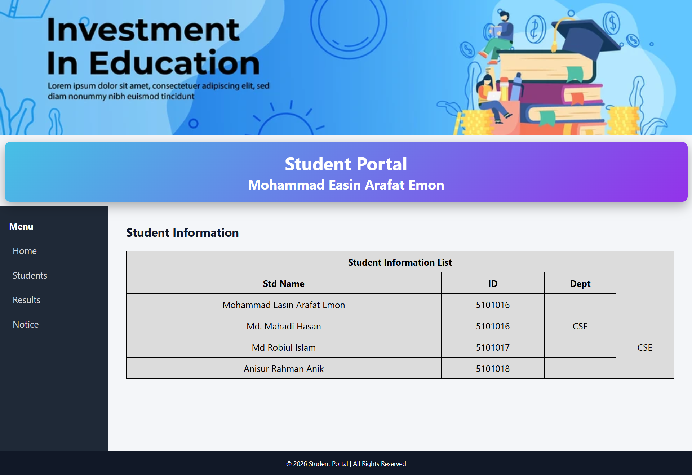

# 🎓 Student Portal Website (HTML & CSS)

A simple Student Portal Website UI built using only **HTML5** and **CSS3**.  
This project contains two main pages:

- 📊 Student Information Dashboard  
- 📝 Student Registration Form  

---

## 📌 Overview

This project is designed to practice front-end web development using pure HTML and CSS without any frameworks or JavaScript.

The website includes:
- A dashboard layout with sidebar navigation and student information table
- A registration form with multiple input types and clean UI design

---

## 🖼️ Project Preview

### 1️⃣ Student Dashboard Page
- Header banner section
- Gradient portal title section
- Sidebar navigation menu
- Student information table
- Footer section

### 2️⃣ Student Registration Form
- Name, ID, Email, Phone fields
- Department dropdown
- Gender radio buttons
- Skills checkboxes
- Address textarea
- Password field
- Date of Birth picker
- Submit & Reset buttons
- Background image design

(Screenshots are added in this repository as reference.)

<!--  -->

---

## 🛠️ Technologies Used

- HTML5
- CSS3
- No JavaScript
- No Frameworks

---

## 📂 Project Structure

```bash
student-portal/
│
├── index.html              # Student Dashboard Page
├── registration.html       # Student Registration Form
├── style.css               # Main CSS File
├── images/                 # Project images/screenshots
│   ├── dashboard.png
│   └── registration.png
└── README.md
```

---

## 🚀 How to Run the Project

1. Clone the repository

```bash
git clone https://github.com/your-username/student-portal.git
```

2. Open the project folder

3. Open `index.html` in your browser

---

## 🎯 Learning Goals

- Practice HTML structure
- Improve CSS styling and layout design
- Create sidebar navigation
- Design tables and forms
- Work with gradients and background images
- Build a clean UI without frameworks

---

## 🔮 Future Improvements

- Make the website fully responsive
- Add form validation using JavaScript
- Add login authentication system
- Connect to backend database
- Improve UI animations

---

## 👨‍💻 Author

**Mohammad Easin Arafat Emon**

---

## 📄 License

This project is open-source and free to use for learning purposes.